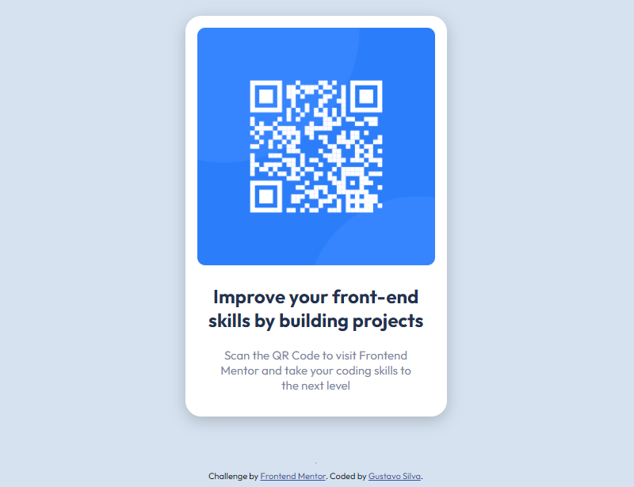

# Frontend Mentor - QR code component solution

This is a solution to the [QR code component challenge on Frontend Mentor](https://www.frontendmentor.io/challenges/qr-code-component-iux_sIO_H). Frontend Mentor challenges help you improve your coding skills by building realistic projects. 

## Table of contents

- [Overview](#overview)
  - [Screenshot](#screenshot)
  - [Links](#links)
- [My process](#my-process)
  - [Built with](#built-with)
  - [What I learned](#what-i-learned)
- [Author](#author)

## Overview

### Screenshot




### Links

- Solution URL: [Add solution URL here](https://www.frontendmentor.io/solutions/html-css-x8ntnHTTn)
- Live Site URL: [Add live site URL here](https://gugas1lva.github.io/Fr.Mentor-02--QR_Code/)

### Built with

- Semantic HTML5 markup
- CSS custom properties
- Flexbox
- CSS Grid
- Mobile-first workflow
- [React](https://reactjs.org/) - JS library
- [Next.js](https://nextjs.org/) - React framework
- [Styled Components](https://styled-components.com/) - For styles

### What I learned

```html
<h1>...</h1>
```
```css
.class {
  color: crimson;
}
```
```js
const loremFunction = () => {
  console.log('🎉')
}
```

## Author

- LinkedIn - [@GustavoSilva](https://www.linkedin.com/in/guga-silva-124706233/)
- GitHub - [@GugaS1lva](https://github.com/GugaS1lva)
- Instagram - [@50repolhoscozidos](https://www.instagram.com/50repolhoscozidos/)
- Email - [contatogustavosilva017@outlook.com](mailto:contatogustavosilva017@outlook.com)
- Frontend Mentor - [@GugaS1lva](https://www.frontendmentor.io/profile/GugaS1lva)
